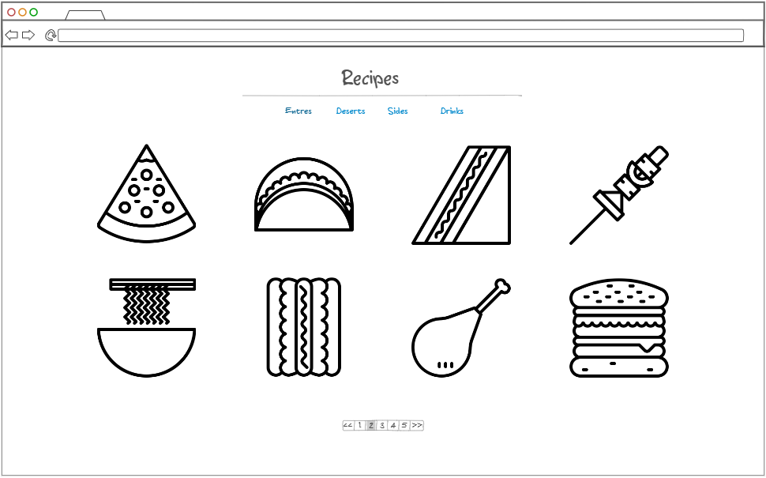
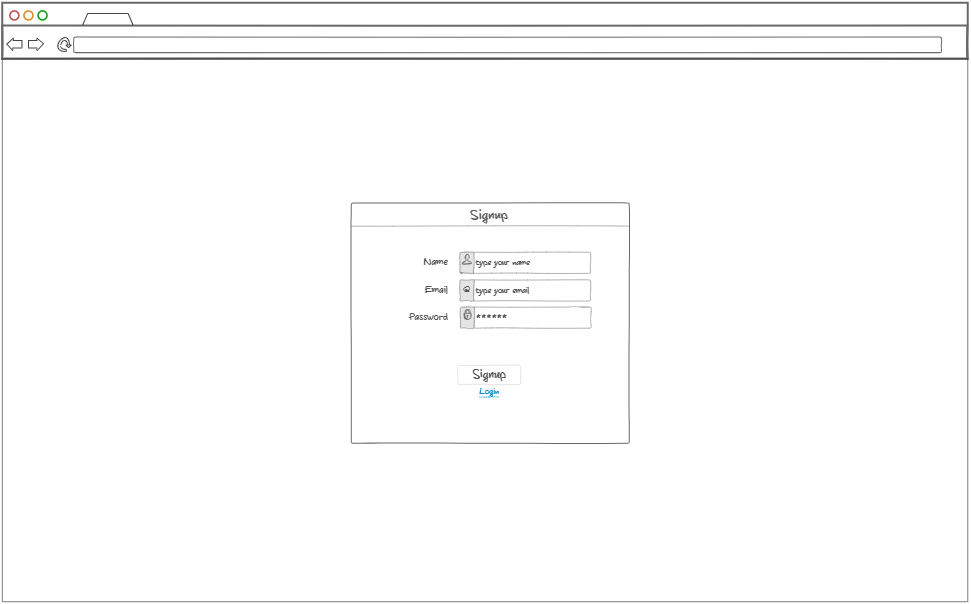
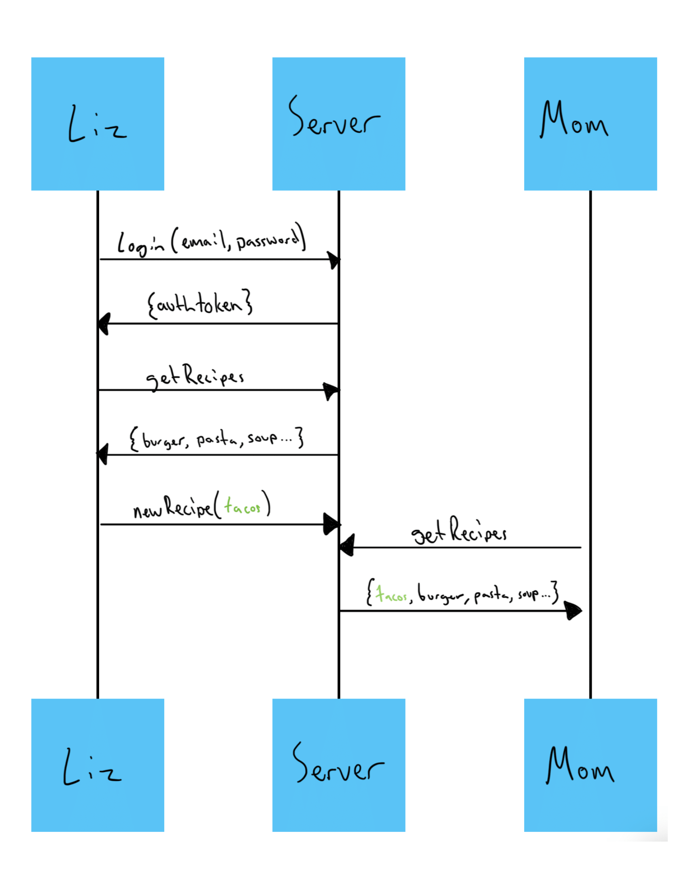

# Liz's Recipes

## Startup Deliverable

### Elevator pitch

What is the best thing to unite a family? Cooking up a good meal and sharing it with everyone. How can we unite a family spread across the country? Cooking up a good meal and sharing the recipe with everyone! My wife, Liz, is an amazing cook. She comes from a family of amazing cooks and she is constantly asking for recipes from various family members to compile into her own personal cookbook. Liz's Recipes makes it so easy for our family to upload our favorite recipes and have them instantly accessible to anyone in the family! Now there's no longer the risk of losing cherished recipes and everyone can share a meal with each other no matter how far away they are!

### Design

Here is a diagram that shows how people interact with the backend to see recipes.

### Key features

- Secure login using HTTPS
- Display of family recipes
- Ability to upload recipes
- Recipes are persistently stored
- Ability to add recipes to "favorites"
- Organization of recipes into categories
- Recipes are available for all users to see as soon as they are saved
- Ability to go back and edit or delete recipes

### Technologies

The required technologies will be implemented in the following ways.

- **HTML** - Will be implemented with the correct HTML structure for the website. Three HTML pages. One for login, one for viewing lists of recipes, and one for showing a recipe.
- **CSS** - Will be used to ensure that the website will look good on different screen sizes, and will utilize whitespace, color, and contrast to make it look good.
- **JavaScript** - Provides logic for login, display of recipes, and backend calls to retrieve and store data in the database.
- **Service** - Backend service that handles:
  - login
  - retrieving recipes
  - saving votes
- **DB** - Store users, authtokens, and recipes.
- **Login** - Register and login users. Credentials are stored privately in the database. Users are unable to login without propper credentials. 
- **WebSocket** - If new recipes are added to the website, all users will be able to see the new recipe in realtime.
- **React** - Application ported to use the React web framework.

## HTML deliverable 

For this deliverable, I built out the rough structure of my website using HTML files.

- **HTML pages** - Four HTML pages that represent the ability to login, see all the recipes, see individual recipes, and see an about page (might end up removing the about page)
- **Links** - All pages link together with the top header, the login page links to the recipes page, and the links on the recipes pages link to a recipe page.
- **Text** - Each recipe has a name associated with it and inside each recipe, the actual process of it will be listed.
- **Images** - Images are included of each recipe.
- **Login** - Input boxes for username and password as well as a login button.
- **Database** - The recipes represent data pulled from the database.
- **WebSocket** - The recipes page updates in real-time as people add recipes to the site.

## CSS deliverable

For this deliverable, I styled the website using CSS to what its final appearance should look like.

- **Header, footer, and main content body** - Each was formated to work with and match each other.
- **Navigation elements** - I made sure that all navigational elements were functional and styled to match the website.
- **Responsive to window resizing** - I made sure the website looked good, no matter how it was resized
- **Application elements** - Kept a standard theme and spacing throughout. 
- **Application text content** - Same or similar fonts throughout the website. 
- **Application images** - Made sure images were ordered properly and wouldn't expand beyond what they should.

## JavaScript deliverable

For this deliverable, I implemented JavaScript so that the application works by storing data in localStorage, so it only persists on local browsers.

- **login** - When you enter your information for login or register, it saves the data and directs the user to the main page.
- **database** - The main page displays recipes that the user has uploaded. For now, this data is stored in localStorage but will be pulled from a database in the future. Each recipe also has a preset picture as I wasn't sure how to have users upload and save photos without using a database.
- **WebSocket** - For now, the only recipes that are available to see are, the default just to show what one will look like, and whatever the user has created. Eventually, it will open up to showing recipes uploaded by anyone with access to the website.
- **application logic** - Each section pulls information from another. recipePage.html pulls data from the recipe that was clicked on from recipes.html. The next and prev buttons go through and show all the recipes stored in localStorage, three at a time, making sure that if the end of the list is reached the next button will not function and vice versa for the prev button.

